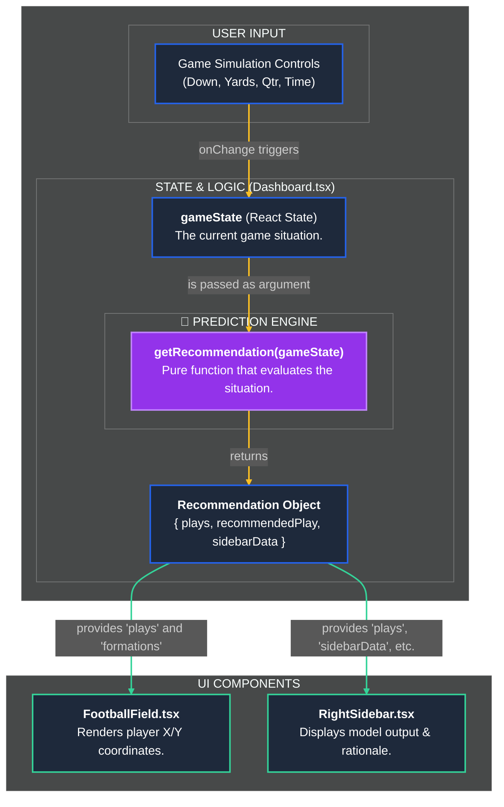

```mermaid
%%{init: {'theme': 'dark', 'themeVariables': { 'primaryColor': '#1e293b', 'primaryTextColor': '#ffffff', 'lineColor': '#475569', 'secondaryColor': '#0f172a'}}}%%
graph TD
    subgraph " "
        direction LR
        subgraph "USER INPUT"
            A["Game Simulation Controls<br><span class='subtitle'>(Down, Yards, Qtr, Time)</span>"]
        end

        subgraph "STATE & LOGIC (Dashboard.tsx)"
            C["<b>gameState</b> (React State)<br><span class='subtitle'>The current game situation.</span>"]
            
            subgraph "🧠 PREDICTION ENGINE"
                D["<b class='fn'>getRecommendation(gameState)</b><br><span class='subtitle'>Pure function that evaluates the situation.</span>"]
            end

            E["<b>Recommendation Object</b><br><span class='subtitle'>{ plays, recommendedPlay, sidebarData }</span>"]
        end
        
        A -- " onChange triggers" --> C
        C -- " is passed as argument" --> D
        D -- " returns" --> E
    end

    subgraph "UI COMPONENTS"
        F["<b>FootballField.tsx</b><br><span class='subtitle'>Renders player X/Y coordinates.</span>"]
        G["<b>RightSidebar.tsx</b><br><span class='subtitle'>Displays model output & rationale.</span>"]
    end

    E -- " provides 'plays' and 'formations'" --> F
    E -- " provides 'plays', 'sidebarData', etc." --> G

    %% Styling
    classDef default fill:#0f172a,stroke:#334155,stroke-width:2px,color:#94a3b8;
    classDef fn fill:#9333ea,stroke:#c084fc,color:white;
    classDef state fill:#1e293b,stroke:#2563eb,stroke-width:2px,color:white;
    classDef ui fill:#1e293b,stroke:#34d399,stroke-width:2px,color:white;
    class A state;
    class C state;
    class E state;
    class D fn;
    class F,G ui;
    linkStyle 0 stroke:#fbbf24,stroke-width:2px;
    linkStyle 1 stroke:#fbbf24,stroke-width:2px;
    linkStyle 2 stroke:#fbbf24,stroke-width:2px;
    linkStyle 3 stroke:#34d399,stroke-width:2px;
    linkStyle 4 stroke:#34d399,stroke-width:2px;
```

